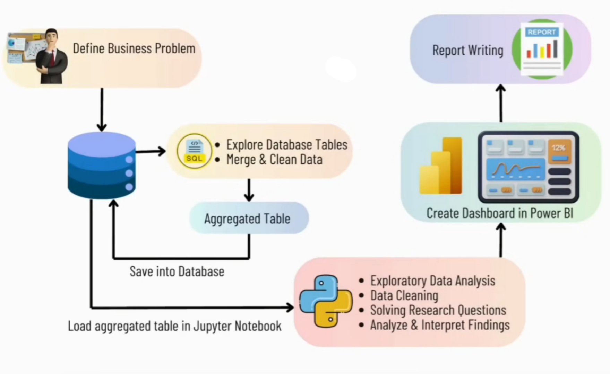
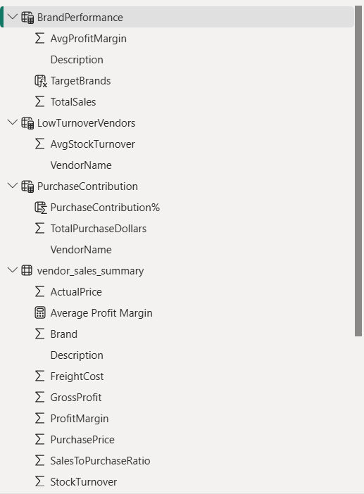
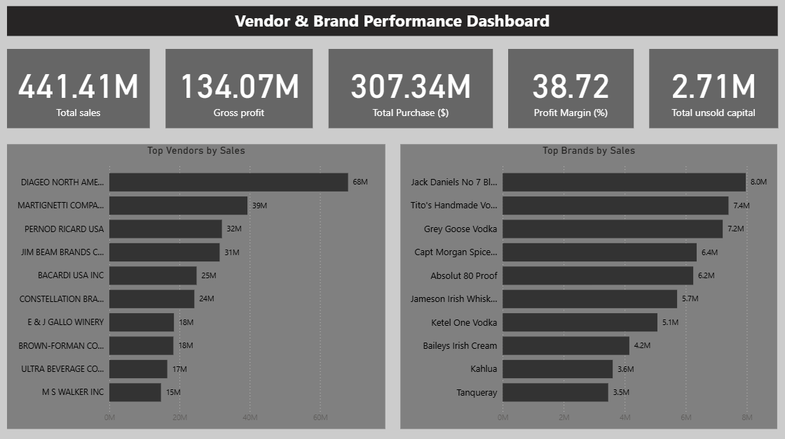

<p align="center">
  
</p>

# Vendor Performance Analysis: Optimizing Vendor & Inventory Strategies

<details open>
<summary><strong><span style="font-size: 1.25em;">Executive Summary and Overview</span></strong></summary>
<br>

This project focuses on **optimizing vendor performance and inventory management** to reduce costs, improve supply chain resilience, and enhance profitability.  

Using a combination of **Power BI**, **Python**, and **SQL**, raw CSV data was transformed into a unified vendor performance dataset, enriched with **statistical analysis** and **business intelligence dashboards**. The final output is a set of **actionable strategies** that address vendor dependency, pricing inefficiencies, bulk purchase benefits, and inventory turnover.  

Stakeholders gain access to a **live, interactive Power BI dashboard** enabling them to explore vendor metrics, brand performance, and purchasing trends in real time.

</details>

---

<details open>
<summary id="table-of-content"><strong>Table of Content</strong></summary>

- [Business Context & Objectives](#business-context--objectives)
- [Project Workflow Overview](#project-workflow-overview)
- [Tools & Technologies](#tools--technologies)
- [Data Preparation & Processing](#data-preparation--processing)
- [Power BI Section Demo](#power-bi-section-demo)
- [Statistical Analysis & Visualizations](#statistical-analysis--visualizations)
- [General Findings](#general-findings)
- [Strategic Findings](#strategic-findings)
- [Recommendations](#recommendations)
- [Technical Execution Details](#technical-execution-details)
- [Folder Structure](#folder-structure)
- [Future Enhancements](#future-enhancements)
- [Contact](#contact)

  </details>

---

<details>
<summary id="business-context--objectives"><strong>Business Context & Objectives</strong></summary>
<br>

Vendor and inventory performance directly influence **profitability**, **cash flow**, and **supply chain stability**. The **core business challenge** is to determine how to **optimize vendor relationships** and **streamline inventory management** in order to reduce costs and enhance operational efficiency.

**Key Objectives:**  
- Identify top- and low-performing vendors.  
- Detect pricing inefficiencies and vendor dependency risks.  
- Improve inventory turnover and reduce slow-moving stock.  
- Validate findings using statistical hypothesis testing.

</details>

---

<details>
<summary id="project-workflow-overview"><strong>Project Workflow Overview</strong></summary>
<br>
  
CSV Files → SQLite Database → Aggregated Vendor Table → SQLite Database → Analysis & Dashboard on Jupyter Notebook → Insights & Recommendations → final report

**Phases:**
- **Phase 1 – Exploratory_Data_Analysis.ipynb**  
  Data ingestion, database setup, aggregated table creation, logging.
- **Phase 2 – Vendor_Performance_Analysis.ipynb**  
  Statistical analysis, answering business questions, creating visualizations, and generating actionable insights.



</details>

---

<details>
<summary id="tools--technologies"><strong>Tools & Technologies</strong></summary>
<br>

| Category | Tools / Languages |
|----------|-------------------|
| **Business Intelligence** | Power BI, DAX, M Language |
| **Python Libraries** | pandas, numpy, matplotlib, seaborn, sqlite3, SQLAlchemy |
| **Database** | SQLite | 
| **SQL Features Used** | JOIN, WHERE, GROUP BY, ORDER BY, Subqueries, CTEs, Table creation |
| **Statistics** | Descriptive statistics, IQR, Percentiles, Quantile discretization, Cumulative sum, Confidence intervals, Hypothesis testing, Significance testing, T-test |
| **IDE / Environment** | Jupyter Notebook |

</details>

---

<details>
<summary id="data-preparation--processing"><strong>Data Preparation & Processing</strong></summary>
<br>

**Manager Summary:**  
Data from multiple CSV files was cleaned, standardized, and merged into a unified vendor performance dataset, powering a **real-time Power BI dashboard** for vendor and inventory insights.

**Technical Details:**  
- **Scripts & Logging:**  
  - `ingestion_db.py` — Loads CSVs into SQLite with large-file handling and ingestion logs (`log/logging.log`).  
  - `get_vendor_summary.py` — Runs SQL aggregations, cleans data, calculates KPIs, uploads summary table, logs to (`log/get_vendor_summary.log`).  

- **Tech Stack Usage:**  
  - **SQL** — JOIN, GROUP BY, CTEs, subqueries, filtering.  
  - **Python (pandas)** — Column creation, type conversion, custom functions, missing-value handling.  
  - **Power BI** — Loaded `vendor_sales_summary`, built calculated tables (BrandPerformance, LowTurnoverVendors, PurchaseContribution), added calculated DAX columns, and designed interactive filters/slicers.  
</details>

---

<details>
<summary id="power-bi-section-demo"><strong>Power BI section demo</strong></summary>
<br>
  
**DAX and table snapshot Views:**
   
<br>

**Dashboard snapshot Views:**
  
  
<p><a href="https://youtu.be/6Yqrk_L77L8" target="_blank" rel="noopener noreferrer">
<strong>▶️ Check Dashbaord live demo on YouTube, click down below</strong>
</a></p>

<a href="https://youtu.be/6Yqrk_L77L8" target="_blank" rel="noopener noreferrer">
  
</a>
  
</details>

---

<details>
<summary id="statistical-analysis--visualizations"><strong>Statistical Analysis & Visualizations</strong></summary>
<br>
  
**Statistical concepts Applied:**
- Descriptive stats (max, min, mean, std, quartiles)
- Outlier detection (IQR)
- Correlation analysis
- Hypothesis testing (t-test, confidence intervals)
- Quantile-based discretization

**Visualizations:**
- Histograms (KDE)
- Boxplots
- Pie & donut charts
- Horizontal bar charts
- Scatterplots
- Heatmaps (correlation)
- KDE plots

</details>

---

<details>
<summary id="general-findings"><strong>General Findings</strong></summary>
<br>

- Loss-making transactions due to high costs or zero revenue.
- Outliers:  
  - Purchase Price max = 5,681.81 vs mean = 24.39  
  - Freight Cost range = 0.09 to 257,032.07  
- Strong correlation between purchase quantity and sales quantity (0.999).
- Weak correlation between purchase price and gross profit (–0.016).


</details>

---

<details>
<summary id="strategic-findings"><strong>Strategic Findings</strong></summary>
<br>
  
- **High-Margin, Low-Sales Brands:** 198 brands show high profitability but low sales volume.  
- **Vendor Dependency:** Top 10 vendors = 65.69% of purchases.  
- **Bulk Purchase Benefits:** 72% lower unit cost for large orders.  
- **Slow-Moving Inventory:** $2.71M tied up in low-turnover stock.  
- **Profit Margin Models:** Low-performing vendors have higher margins but lower sales.  
- **Statistical Validation:** Significant profit margin difference between top & low vendors.


</details>

---

<details>
<summary id="recommendations"><strong>Recommendations</strong></summary>
<br>

1. Re-evaluate pricing for high-margin, low-sales brands.
2. Optimize slow-moving stock with refined purchasing and clearance promotions.
3. Support low-performing vendors with targeted marketing and expanded distribution.
4. Align bulk purchasing with demand to reduce costs without overstocking.
5. Diversify vendor base to reduce dependency risk.


</details>

---

<details>
<summary id="technical-execution-details"><strong>Technical Execution Details</strong></summary>
<br>

- **SQL:** JOINs, aggregations, subqueries, CTE-based summaries.
- **Python:** Data cleaning, metric calculations, outlier detection, binning.
- **Logging:** Centralized logs for ingestion & summary creation.

</details>

---

<details>
<summary id="folder-structure"><strong>Folder Structure</strong></summary>
<br>

```bash
vendor-performance-analysis/
│
├── assets/
|    └── Project_Flowchart.png                         # Images & banners for README
|
├── data/
|    └── processed/                                    # Agreegated table after initial analysis
|    |    └── vendor_sales_summary_sample.csv
|    |
|    └── raw/                                          # Raw & cleaned datasets with limited records
|         └── begin_inventory_sample.csv
|         └── end_inventory_sample.csv
|         └── purchase_prices_sample.csv
|         └── purchases_sample.csv
|         └── sales_sample.csv
|         └── vendor_invoice_sample.csv           
|
├── deliverables/
|    └── final_report.pdf
|    └── vendor_performance_analysis_dashboard.pbix
|
├── log/
|     └── ingestion_db.py         # Logging files
|     └── get_vendor_summary.log
|
├── notebooks/
|    └── Exploratory_Data_Anaysis.ipynb
|    └── Vendor_Performance_Analysis.ipynb              # Jupyter notebooks
| 
├── scripts/
|    └── get_vendor_summary.py                                # Jupyter notebooks
|    └── ingestion_db.py
|                               
├── visuals/
|    └── P1.png
|    └── P2.png
|    └── P3.png
|    └── P4.png
|    └── P5.png
|    └── P6.png
|    └── P7.png
|    └── P8.png
|    └── P9.png
|    └── P10.png
|    └── P11.png
|    └── P12.png                           
|    └── P13.png
|    └── P14.png
|    └── P15.png
|    └── P16.png
|    └── P18.png
|    └── P19.png
|    └── logo.jpeg
|    └── power_bi_dashboard_live_demo.mp4 
|               
├── README.md
|
└── requirements.txt                                 # Important libraries from python that were used
```

</details>

---

<details> <summary id="future-enhancements"><strong>Future Enhancements</strong></summary>
<br>
  
- Real-time vendor tracking

- Automated KPI alerts

- Predictive vendor risk modeling

- Multi-year trend analysis

</details>

---

<details> <summary id="contact"><strong>Contact</strong></summary>
<br>
  
Author: Rajdeep Ray
📧 Email: rajdeepray.c48.it@gmail.com
💼 LinkedIn: https://www.linkedin.com/in/rajdeep-ray-3616501b6/
🐙 GitHub: https://github.com/deadlineZeus/vendor-inventory-performance-analysis-sqlite-python-powerbi

</details> 

---
