# Vendor Performance Analysis: Optimizing Vendor & Inventory Strategies

<strong>Executive Summary and Overview</strong>

 

This project focuses on **optimizing vendor performance and inventory management** to reduce costs, improve supply chain resilience, and enhance profitability.  

Using a combination of **Power BI**, **Python**, and **SQL**, raw CSV data was transformed into a unified vendor performance dataset, enriched with **statistical analysis** and **business intelligence dashboards**. The final output is a set of **actionable strategies** that address vendor dependency, pricing inefficiencies, bulk purchase benefits, and inventory turnover.  

Stakeholders gain access to a **live, interactive Power BI dashboard** enabling them to explore vendor metrics, brand performance, and purchasing trends in real time.

---

<strong>Table of Content</strong>

- [Business Context & Objectives](#business-context--objectives)
- [Project Workflow Overview](#project-workflow-overview)
- [Tools & Technologies](#tools--technologies)
- [Data Preparation & Processing](#data-preparation--processing)
- [Power BI Section Demo](#power-bi-section-demo)
- [Statistical Analysis & Visualizations](#statistical-analysis--visualizations)
- [General Insights](#general-insights)
- [Strategic Insights](#strategic-insights)
- [Recommendations](#recommendations)
- [Technical Execution Details](#technical-execution-details)
- [Folder Structure](#folder-structure)
- [Future Enhancements](#future-enhancements)
- [Contact](#contact)

---

...

<strong>General Insights</strong>

**_(Click each insight to see the supporting chart)_**

• Some products incur significant losses, with gross profit minimum reaching -52,000+, indicating pricing or cost issues.

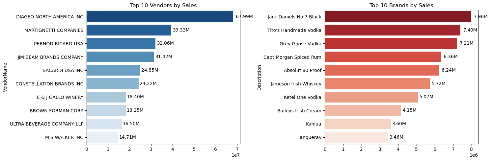

• Strong correlation (0.999) between purchase quantity and sales quantity confirms effective inventory turnover.

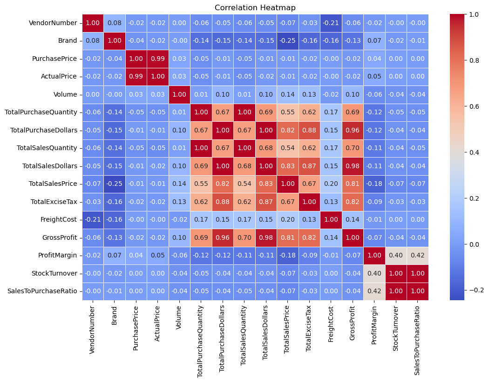

• Freight costs vary hugely, from less than 1 to over 250,000, highlighting potential logistics inefficiencies or bulk shipments.

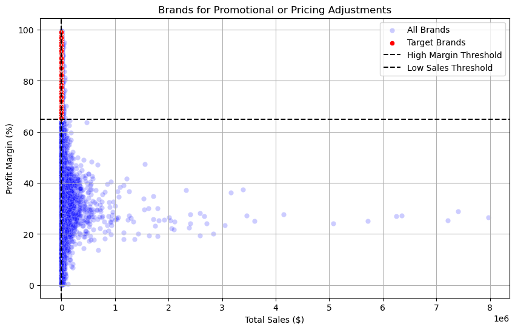

• Stock turnover ranges widely; some products sell fast, others remain in stock indefinitely, impacting working capital.

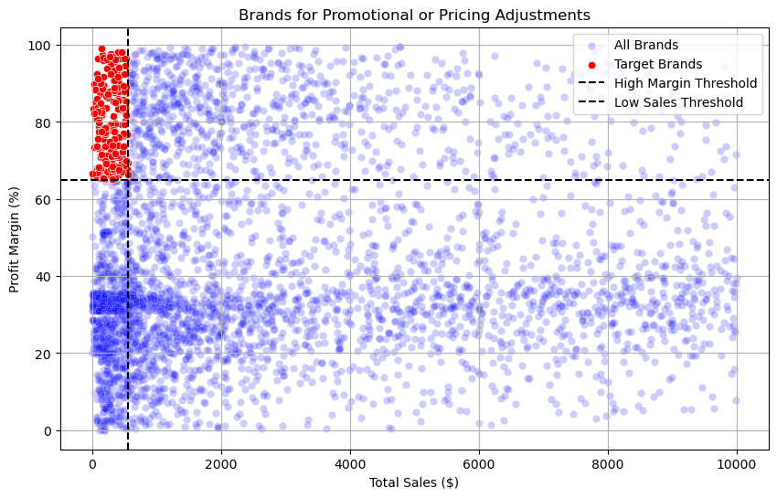

• Price variations have little impact on sales revenue or gross profit, indicating other factors drive profitability.

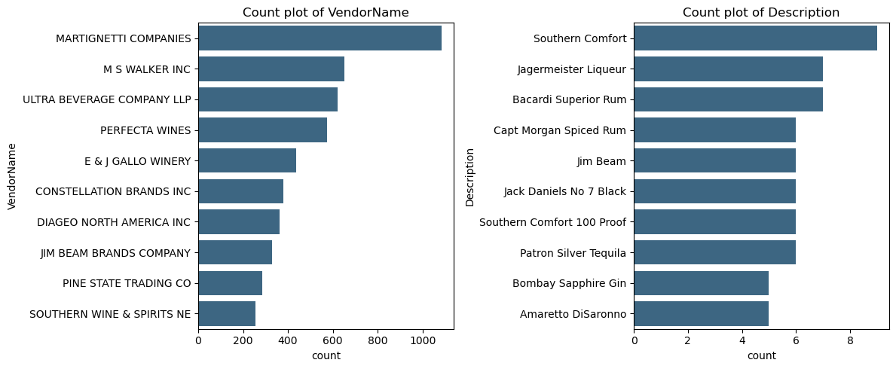

• Higher sales prices tend to correlate with lower profit margins, possibly due to competitive pricing pressures.

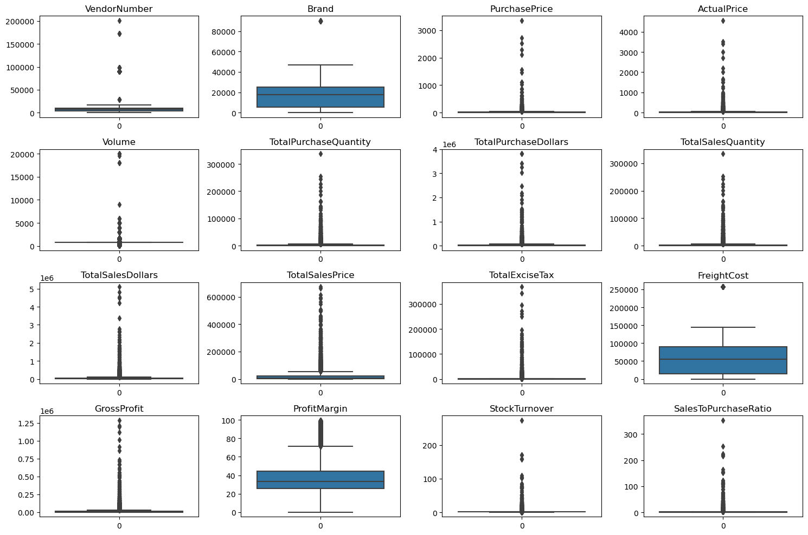

---

<strong>Strategic Insights</strong>

**_(Click each insight to see the evidence)_**

• High-Margin, Low-Sales Brands: 198 brands show high profitability but low sales volume.

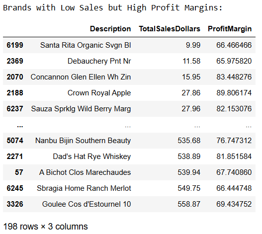

• Vendor Dependency: Top 10 vendors = 65.7% of purchases.

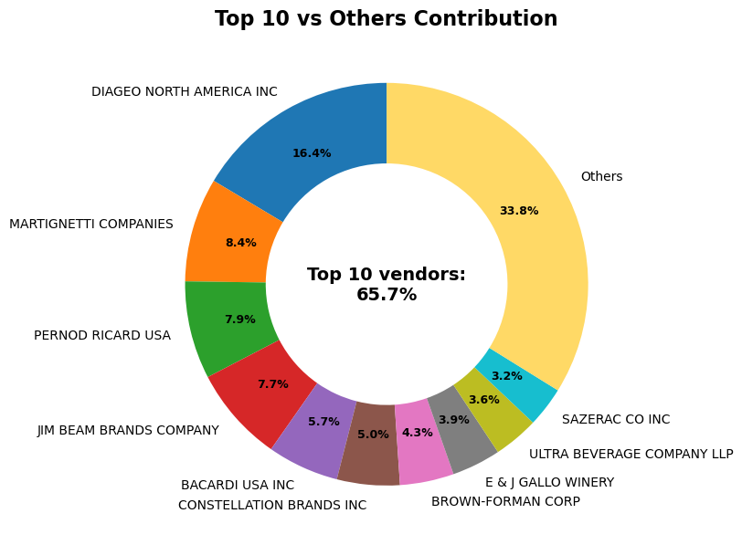

• Bulk Purchase Benefits: 72% lower unit cost for large orders.

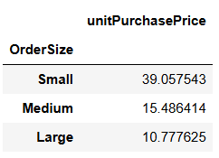

• Slow-Moving Inventory: $2.71M tied up in low-turnover stock.

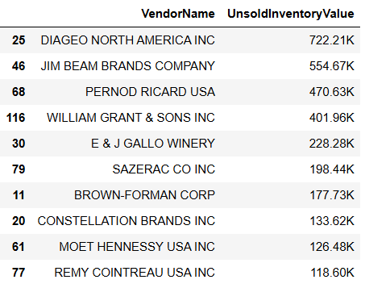

• Profit Margin Models: Low-performing vendors have higher margins but lower sales.

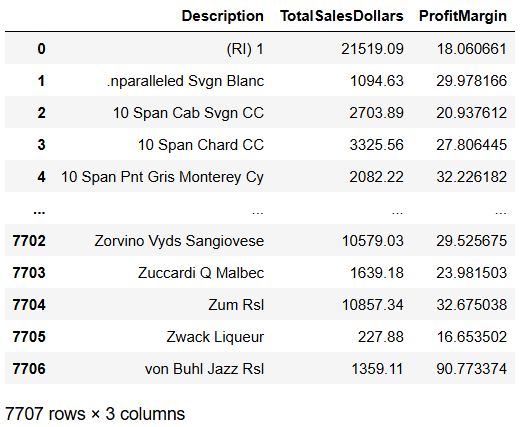

• Statistical Validation: Significant profit margin difference between top & low vendors.

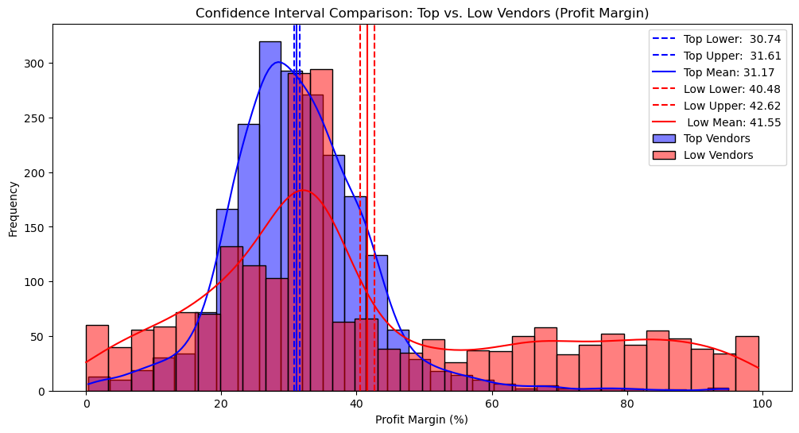

